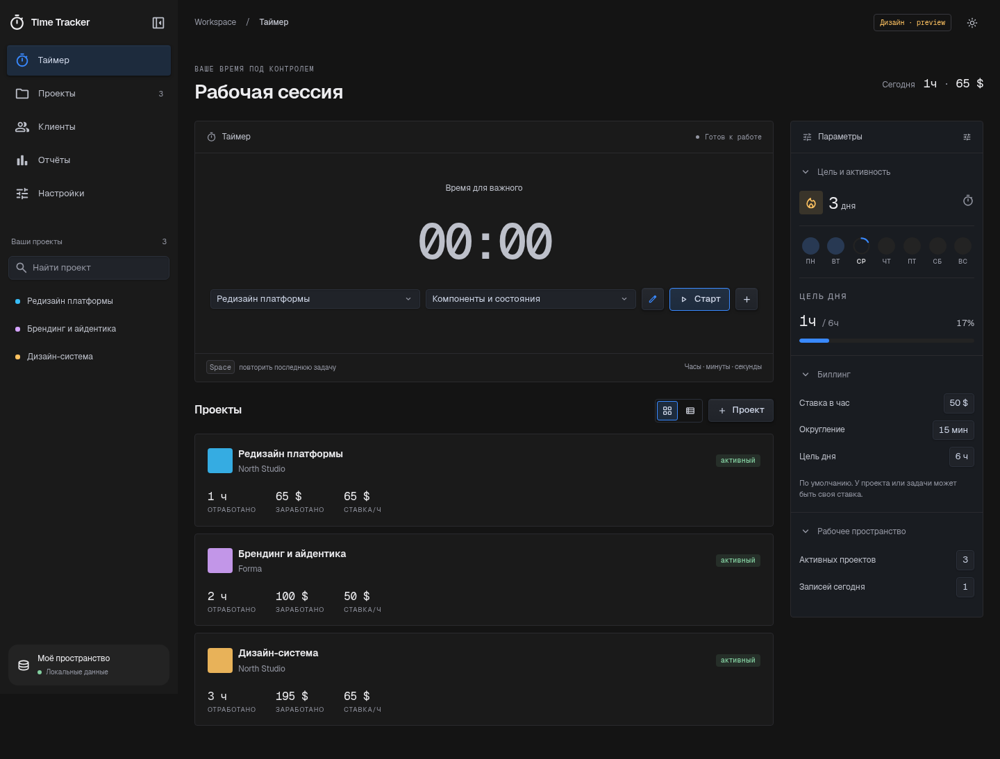

# Time Tracker — тестовый редизайн и аудит

Дата: 7 октября 2026. Ветка: `codex/editor-design-preview`.

## Тестовый вариант

Референс: [Shaders](https://github.com/shader-effects-inc/shaders) и предоставленный скриншот панели редактора. В публичном репозитории находятся движок WebGPU и компоненты эффектов; исходники дизайн-редактора туда не входят. Интерфейс Time Tracker реализован самостоятельно по визуальному референсу. WebGPU-зависимость не добавлена: для панелей и контролов достаточно CSS.

- Графитовые поверхности, тонкие границы, компактные поля, синие активные элементы и янтарные подписи.
- Боковая панель по образцу ChatGPT: поиск проектов, закрытие/открытие, сохранение выбранного состояния. Только настольная компоновка, без мобильной навигации. Минимум окна Electron — 960 × 640 px.
- Рабочая область таймера и сворачиваемый инспектор: цель дня, активность, ставки и сводка.
- Общие стили проектов, клиентов, детализации, отчётов, настроек, модальных окон и popover.
- Светлая тема, видимый фокус, нативные select, клавиатурное открытие карточек, связанные с полями подписи, reduced motion.
- Локальные переменные шрифты Geist и Geist Mono с кириллицей. Семейства подобраны под направление Shaders; точные CSS сайта недоступны в этой среде, совпадение с текущим сайтом не утверждается.
- Контролы по визуальному референсу Shaders Editor: прямоугольные кнопки и заполненные графитовые поля высотой 28 px (кнопки — 32 px), скругления 4 px, тонкие границы, компактные переключатели и диалоги. Синий акцент используется для выделения и фокуса. Google Material Symbols используются только для иконок; оформление Material 3 удалено.
- Уточнение по новому скриншоту пользователя: холодные графитовые контролы, приглушённый светлый текст, прямоугольные цветовые образцы и выбранные элементы. Общие токены для главного окна и popover; устранены отдельные заливки running/archive/update/sync-кнопок. Hover/pressed — согласованные состояния реализации: по статичному скриншоту их точное совпадение проверить нельзя.
- Актуальный референс: [панель Transform / Colors / Position](https://shaders.com/design-editor/3d104575-2609-4e3c-9525-fd3f7aa07c60), предоставленная пользователем через браузерный комментарий. Синяя рамка комментария не является стилем приложения.
- Дополнительный референс: [указанный редактор](https://shaders.com/design-editor/b221e122-419d-4a0e-99b4-5072ac448369). Доступ из среды возвращает HTTP 403, поэтому стили воссозданы по исходному скриншоту пользователя, а не скопированы из недоступного проекта.
- 31 официальный SVG Material Symbols Rounded из репозитория Google вместо прежних иконок, включая popover и favicon. Исходная ревизия и лицензия — `src/assets/material-symbols/NOTICE.md`; лицензии также входят в `dist/licenses`.

Скриншоты сделаны с **синтетическими демонстрационными данными**, которые не добавляются в приложение автоматически:

[Тёмная тема](preview/desktop.png) · [Активный таймер](preview/running.png) · [Панель закрыта](preview/collapsed.png) · [Светлая тема](preview/light.png) · [Отчёты](preview/reports.png).



## Как проверить

```bash
npm ci
npm run dev
```

Открыть адрес Vite. Для проверки использовать отдельный профиль браузера: внутри одного origin приложение сохраняет данные по прежнему ключу `time-tracker-v1`.

```bash
npm test
npm run build
npm run test:ui
npm run test:ui:persistence
```

UI-проверка требует запущенного Vite и установленного Google Chrome. Для другого Chromium задать `CHROMIUM_PATH`; для другого сервера — `UI_BASE_URL`. В Linux CI:

```bash
CI=1 CHROMIUM_PATH=/usr/bin/chromium npm run test:ui
```

Скрипт создаёт отдельный временный профиль браузера и использует только тестовые данные. Playwright добавлен в devDependencies, в приложение не попадает.

## Исправленные дефекты

| Проблема | Сценарий и исправление | Проверка |
| --- | --- | --- |
| Цель дня расходилась с итогами | Таймер с перенесённой на вчера датой увеличивал сегодняшнюю цель. Прогресс и недельная полоса теперь используют ту же привязку к дате, что и итоги. | UI smoke: вчерашний таймер на 1 час даёт сегодня 0 минут. |
| Откат системных часов уменьшал накопленное время | Отрицательная разница времени попадала в reducer при паузе/остановке, хотя UI уже ограничивал её нулём. Используется общий расчёт `timerElapsed`. | Unit: накопленные 10 секунд сохраняются при откате часов. |
| Импорт принимал чужой projectId у задачи | Оба ID существовали, но относились к разным проектам, что искажало ставки и отчёты. Проверяется соответствие задачи проекту. | Unit: корректная запись сохраняется, несовместимые запись и таймер отбрасываются. |
| CSV мог исполнять пользовательский текст как формулу | Название/заметка, начинающиеся с `=`, `+`, `-`, `@`, защищаются апострофом; числовые значения остаются числами. Добавлено экранирование CR. | Unit и реальное скачивание CSV в браузере. |
| Модальные окна не изолировали фокус | Нативный dialog, циклический Tab, возврат фокуса, Escape, блокировка фоновых действий. Пробел и повтор клавиши не переключают таймер при открытом окне. | UI smoke: полный цикл Tab, закрытие и возврат фокуса. |
| Кастомный select не поддерживал стандартную клавиатурную навигацию | Заменён нативным select с общей стилизацией и доступным именем. | Выбор интервала биллинга через браузерный select. |

Продолжение аудита: устранены приоритетные проблемы сохранения и синхронизации.

| Проблема | Исправление | Проверка |
| --- | --- | --- |
| Ошибка квоты или файловой записи скрывалась | Уведомление в рабочей области, повтор и JSON-копия текущего состояния из памяти; перехват false и отклонённых IPC promises. | Unit + браузер: quota/IPC failure → выгрузка работающего таймера → успешный повтор. |
| Входящий файл заменял локальный таймер и изменения | Любая расходящаяся локальная работа или активный/приостановленный таймер требуют выбора версии. Перед заменой альтернативная версия скачивается как JSON. При выборе локальной версии берётся последнее состояние, включая изменения после появления уведомления. | Unit + браузер: два таймера, удалённая задача, пауза во время конфликта, обе ветви выбора. |
| Запоздалый loadData заменял изменения в окне | До завершения чтения запись в файл приостановлена; непустой отличающийся локальный кэш сохраняется для выбора. Устаревший ответ загрузки после более нового внешнего события игнорируется. | Браузер: создание проекта до ответа loadData, без преждевременной записи файла. |
| Перекрывающиеся записи использовали старую базовую версию | IPC-записи выполняются последовательно; следующая использует подтверждённый результат предыдущей. Отложенная запись отменяется при входящем конфликте/смене папки. | Unit: задержанный ответ, новая запись, смена базовой версии. |
| Повреждённый файл считался отсутствующим | Только ENOENT возвращает null. Остальные ошибки чтения при загрузке передаются в интерфейс; повреждённый файл не перезаписывается. Null в условии записи теперь защищает от файла, созданного другим устройством после загрузки. | Реальные файловые IPC-обработчики в изолированной Node-среде: повреждённый JSON, создание файла между load/save, повторный конфликт. |

При выборе версии JSON скачивается обычным механизмом браузера/Electron. Это выгрузка копии, не автоматическое слияние двух историй. Существующие методы IPC сохранены, уточнена семантика ошибок чтения и условия `expectedRaw=null`.

Схема данных и ключ localStorage сохранены. Важная граница совместимости: некорректные связи task/project теперь отбрасываются, как уже отбрасывались записи с отсутствующими ID. Исходный файл бэкапа не изменяется.

## Оставшиеся проблемы и приоритеты

Это аудит кода и ограниченная проверка сценариев, не гарантия отсутствия других дефектов.

### P2 — завершать отложенное сохранение перед выходом

`src/lib/storage.ts`: запись в Electron отложена на 400 мс. При завершении процесса внутри этого окна файл может остаться старым. Теперь различие с непустым локальным кэшем при запуске вызывает выбор версий, поэтому файл не заменяет кэш молча. Сам flush при выходе ещё не реализован; особенно важно проверить случай одновременного отказа localStorage и завершения процесса до файловой записи. Принудительное завершение нативного приложения не проверялось.

Следующий шаг: flush при штатном выходе и ревизии снимков для выбора более свежего состояния при запуске. Очередь с подтверждением уже реализована. Понадобится согласованное изменение main/preload/типов IPC.

### P2 — сократить повторную обработку истории

- `TodayScreen` обновляется каждую секунду даже без работающего таймера; вместе с ним перерисовываются карточки. Вынести тикающий блок, обновлять календарный день отдельно, мемоизировать списки. В этом изменении счётчик записей уже включён в мемоизированную сводку.
- `ClientsScreen` запускает `getClientWorkSummary` для каждого клиента, каждый раз обходя общие массивы. Построить индекс и агрегаты всех клиентов за один проход; измерить на большой истории.
- `saveState` сериализует весь JSON при каждом изменении заметки. Отделить мгновенное состояние формы от сохранения и согласовать debounce с flush, чтобы оптимизация не теряла данные.
- `reportRange('all')` использует `Math.min(...entryStarts)`: очень большой импорт может превысить лимит аргументов. Заменить на reduce; для многолетних графиков агрегировать по неделям/месяцам и ограничить число SVG-элементов.

### Дальнейшие улучшения UX

Добавить поиск проектов и задач, явный статус сохранения и предварительный просмотр импорта с количеством отклонённых записей. Если нужно распределять ночную сессию между календарными днями, сначала определить правило учёта пауз: сейчас вся запись относится к дате старта, и редизайн это правило сохраняет.

## Результаты проверки

- `npm test`: 40 тестов, 9 файлов, успешно.
- `npm run build`: успешно; главный JS около 218 KB + общий React/icon chunk около 157 KB до gzip (примерно 117 KB суммарно после gzip); локальные WOFF2-файлы — около 147 KB, подмножества загружаются по используемым символам. Это контрольный размер, не заявленное ускорение.
- `npm run test:ui`: закрытие/открытие панели и сохранение предпочтения, поиск проектов, загрузка локальных шрифтов, создание проекта и задачи, rename, start/pause/resume/stop, перезагрузка работающего и остановленного на паузу таймера, дата, фокус, тема, CSV, настройки.
- Все 5 основных экранов проверены на настольных ширинах 960, 1160, 1440 и 1920 px: горизонтального переполнения страницы нет, ошибок JavaScript нет. Таблицы имеют собственный горизонтальный скролл.
- `npm run test:ui:persistence`: отказы квоты/IPC, JSON из текущей памяти, повтор записи, конфликт таймеров и удаление задачи, изменения во время конфликта и задержанная загрузка. Используются отдельные профили и имитация desktop bridge.
- Popover renderer: pause/resume/stop проверены в Chromium с имитацией IPC. Нативные tray/vibrancy, установщики Windows/macOS, реальная файловая синхронизация и системный PDF-диалог в этой Linux-среде не проверялись.

## Публикация

Это preview-ветка. Версия 0.2.5, release workflow и теги не менялись, прод-релиз не выполнялся. Перед продом: оценить дизайн, проверить flush/восстановление при выходе, реальную синхронизацию и установщики на Windows/macOS. Затем выпускать версию обычным процессом проекта.
