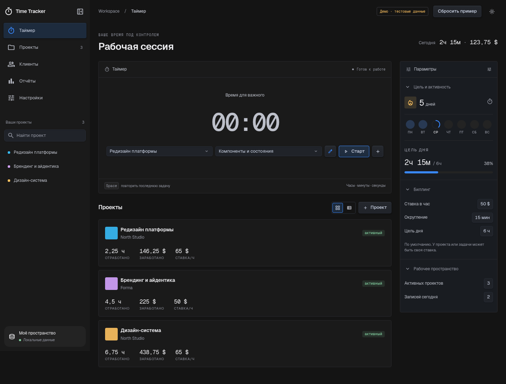

# Интерактивный тест нового дизайна

Демоверсия использует те же React-экраны и CSS, что и приложение: таймер, проекты, клиенты, отчёты, настройки, формы и кнопки с тенями. Это рабочий тест интерфейса для ПК, а не набор скриншотов.

## Открыть готовый HTML

Файл `time-tracker-design-preview.html` содержит JavaScript, CSS, шрифты, иконки и лицензии. Его можно скопировать на другой ПК и открыть в Chrome/Edge. Если политика браузера запрещает локальные HTML-файлы, используйте локальный сервер по инструкции ниже.

В первом запуске уже есть 3 проекта, 2 клиента, 3 задачи и 9 записей с демонстрационными данными. Работают таймер, формы, сворачивание панели, светлая тема, CSV и браузерная печать отчёта. Кнопка «Сбросить пример» после подтверждения восстанавливает исходные примеры.

Тестовые изменения сохраняются в ключе `time-tracker-design-preview-v1`, состояние панели — в `time-tracker-design-preview-sidebar`. Основной ключ `time-tracker-v1` и прежний ключ миграции не читаются и не меняются. В демосборке отключён доступ к Electron bridge: она не синхронизирует файлы и не проверяет обновления приложения.

## Собрать из исходников

```bash
npm ci
npm run build:design-preview
npm run preview:design
```

Открыть `http://127.0.0.1:5175/time-tracker-design-preview.html`.

Готовый переносимый файл: `dist-design-preview/time-tracker-design-preview.html`. Остальные файлы рядом нужны только для отладки, копировать их не требуется. Обычная команда `npm run build` продолжает собирать приложение в `dist` без демонстрационных проектов.

## Проверка

```bash
npm test
npm run build
npm run build:design-preview
npm run test:ui:design
```

Для Chromium в Linux: `CI=1 CHROMIUM_PATH=/usr/bin/chromium npm run test:ui:design`.

Сценарий запускает временный локальный HTTP-сервер и отдельный профиль браузера. Проверяет старт/паузу/восстановление таймера, экраны, панель, подтверждение сброса, светлую тему, выгрузку CSV и изоляцию рабочего хранилища. После загрузки отключает сеть; внешние ресурсы не запрашиваются. Проверка file:// в рабочей среде недоступна из-за политики Chromium. Нативный диалог сохранения PDF и интеграции Electron не входят в этот тест.


